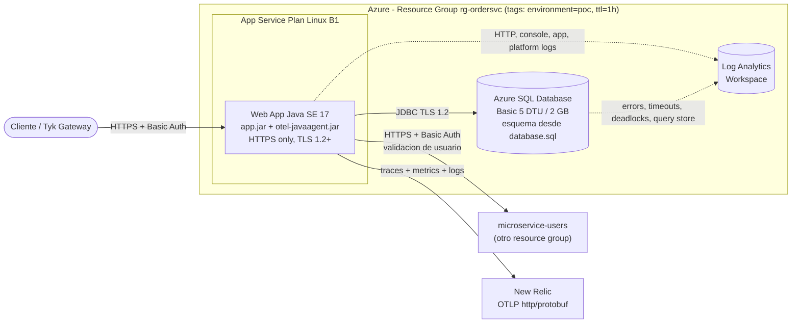

# PoC microservice-orders - Azure App Service + Azure SQL + New Relic

API REST de pedidos (Spring Boot 3.2.5, Java 17) desplegada en **Azure App Service Linux** con
**Azure SQL Database**, instrumentada con el **agente OpenTelemetry Java (zero-code)** hacia
**New Relic**, y con **Azure Monitor** recogiendo los logs y métricas de plataforma.

No hay una sola línea de instrumentación en el código de negocio: el agente se adjunta al
arrancar y de ahí salen trazas, métricas y logs correlacionados.

Despliegue automático desde GitHub Actions con autenticación **OIDC federada** (sin client
secrets) y dimensionado para el mínimo coste posible en un PoC de vida corta.

> **Este servicio depende de `microservice-users`.** Todos los endpoints de pedidos validan
> primero el usuario contra ese servicio. Despliega `poc-microservice-users` **antes** y
> configura aquí la variable `GATEWAY_BASE_URL`.
>
> **Y la llamada no es directa: va a través del gateway de Tyk.** Eso crea un ciclo en el
> arranque del PoC, porque el gateway necesita la URL de orders para enrutar. Se rompe
> desplegando orders dos veces, ver [10.1](#101-orden-correcto).

| Si quieres... | Ve a |
|---------------|------|
| Llamar a la API | [3. Cómo usar la API](#3-cómo-usar-la-api) |
| Ver trazas, métricas y logs en New Relic | [4. Cómo ver la telemetría en New Relic](#4-cómo-ver-la-telemetría-en-new-relic) |
| Ver una traza que cruza orders y users | [4.4 Trazas distribuidas](#44-trazas-distribuidas-entre-orders-y-users) |
| Ver lo que pasa en la base de datos | [5. Telemetría de base de datos](#5-telemetría-de-base-de-datos) |
| Consultar los logs de plataforma de Azure | [6. Azure Monitor y Log Analytics](#6-azure-monitor-y-log-analytics) |
| Arreglar que no llegan datos | [7. Si no llega telemetría](#7-si-no-llega-telemetría) |
| Entender por qué hay un paso de esquema SQL | [8. El esquema de base de datos](#8-el-esquema-de-base-de-datos) |
| Desplegarlo desde cero | [9. Configuración previa](#9-configuración-previa) y [10. Despliegue](#10-despliegue) |
| Borrarlo para no pagar | [14. Limpieza de recursos](#14-limpieza-de-recursos) |

---

## 1. Arquitectura



### Recursos creados

| Recurso | Nombre | SKU / configuración |
|---------|--------|---------------------|
| Resource Group | `rg-ordersvc` | tags `environment=poc`, `ttl=1h`, `owner`, `project`, `createdAt` |
| Log Analytics Workspace | `log-ordersvc` | PerGB2018, retención 30 días, cuota diaria 1 GB |
| App Service Plan | `plan-ordersvc` | Linux **B1** (configurable a F1 o B2) |
| Web App | `app-ordersvc-<hash>` | Java SE 17, `httpsOnly`, TLS 1.2, FTPS deshabilitado, Always On, health check en `/actuator/health`, identidad administrada |
| SQL Server | `sql-ordersvc-<hash>` | TLS mínimo 1.2, firewall solo para servicios de Azure |
| SQL Database | `sqldb-orders` | **Basic** 5 DTU, 2 GB, backup local |
| Diagnostic Settings | `diag-ordersvc-app`, `diag-sqldb-orders` | `allLogs` + métricas hacia Log Analytics |

Nada tiene que existir previamente: `infra/main.bicep` trabaja a nivel de suscripción y crea
incluso el resource group. Los datos de la base de datos llegan al App Service por salidas de
módulo (`sql.outputs.*`), así que no hay ningún nombre escrito a mano y ARM deduce que la base
de datos se crea antes que la aplicación.

---

## 2. Estructura del proyecto

```
src/main/java/com/example/ordersapp/
├── client/dtos/    ApiErrorDto, UserDto, UserSingleEnvelope (respuestas de users)
├── config/         SecurityConfig, WebConfig, TraceIdInterceptor
├── controllers/    OrderController, SystemController
├── exceptions/     GlobalExceptionHandler y excepciones de dominio
├── filters/        RequestLoggingFilter (log de entrada/salida + atributos de traza)
├── logging/        LevelMdcTurboFilter (expone el nivel como atributo en New Relic)
├── models/         Order, OrderItem, OrderStatus
├── repository/     OrderRepository (Spring Data JPA)
├── services/       OrderService, UserValidationService
└── system/         SystemService y su respuesta de /status

src/main/resources/
├── application.yaml     Configuración por variables de entorno
├── database.sql        Esquema idempotente que aplica el pipeline
└── logback-spring.xml

infra/
├── main.bicep          Infraestructura del PoC (scope: suscripción)
├── main.bicepparam     Parámetros leídos de variables de entorno
├── newrelic.bicep      Integración nativa de New Relic (una vez por suscripción)
├── newrelic.bicepparam
└── modules/            appservice, sql, monitoring, newrelic-monitor

.github/workflows/
├── deploy.yml                      Build, infra, esquema, despliegue y smoke tests
├── newrelic-native-integration.yml Integración nativa de Azure con New Relic
└── newrelic-azure-integration.yml  Integración de métricas de Azure por polling

Dockerfile      Alternativa en contenedor, no la usa el pipeline
startup.sh      Startup command de App Service: adjunta el agente si el jar está
.env.example    Plantilla de entorno local, sin secretos reales
```

Salvo los nombres (`ordersvc`, `sqldb-orders`, `microservice-orders`) y lo propio de este
servicio (las credenciales de entrada, la dependencia `GATEWAY_*` y el paso de esquema), la
infraestructura es **la misma** que en `poc-microservice-users`: `monitoring.bicep`, `sql.bicep`
y los tres ficheros de la integración nativa de New Relic son idénticos fichero a fichero.

---

## 3. Cómo usar la API

### 3.1 Obtener la URL y las credenciales

```bash
APP=$(az webapp list -g rg-ordersvc --query "[0].name" -o tsv)
URL="https://$(az webapp show -g rg-ordersvc -n "$APP" --query defaultHostName -o tsv)"
echo "$URL"

export BASIC_AUTH_USER=...  BASIC_AUTH_PASSWORD=...
AUTH="-u $BASIC_AUTH_USER:$BASIC_AUTH_PASSWORD"
```

Cuidado con los dos pares de credenciales, que es la confusión más habitual de este servicio:

| Par | Para qué |
|-----|----------|
| `BASIC_AUTH_USER` / `BASIC_AUTH_PASSWORD` | Lo que **este** servicio exige a quien le llama. Es lo que usas en tus `curl` |
| `GATEWAY_BASIC_USER` / `GATEWAY_BASIC_PASSWORD` | Lo que **este** servicio presenta al gateway de Tyk, que es por donde llama a `microservice-users`. Nunca lo usas tú directamente |

### 3.2 Necesitas un usuario que exista

Todos los endpoints de pedidos llaman antes a `GET {GATEWAY_BASE_URL}{GATEWAY_USERS_PATH}/users/{userId}`, es decir a través del gateway. Si el
usuario no existe devuelven `404`, y si el servicio de usuarios no responde, `503`. Así que lo
primero es crear un usuario en el otro servicio y quedarte con su id:

```bash
USERS_URL=https://app-usersvc-xxxx.azurewebsites.net
USER_ID=$(curl -s -X POST -u "$BASIC_AUTH_USER:$BASIC_AUTH_PASSWORD" "$USERS_URL/users" \
  -H "Content-Type: application/json" \
  -d '{"name":"Ada Lovelace","email":"ada@example.com"}' | jq -r .data.id)
echo "$USER_ID"
```

### 3.3 Endpoints

| Método | Ruta | Autenticación | Valida usuario | Respuesta correcta |
|--------|------|---------------|----------------|--------------------|
| `GET` | `/actuator/health` | pública | no | `200` con el estado de la app y de la base de datos |
| `GET` | `/actuator/info` | pública | no | `200` con la información de la build |
| `GET` | `/actuator/metrics` | pública | no | `200` con la lista de métricas de Micrometer |
| `GET` | `/actuator/prometheus` | pública | no | `200` con las métricas en formato Prometheus |
| `GET` | `/status` | Basic Auth | no | `200` con el estado de base de datos, salida HTTP y servicio de usuarios |
| `GET` | `/users/{userId}/orders` | Basic Auth | sí | `200` con los pedidos. Admite `?status=PENDING` |
| `GET` | `/users/{userId}/orders/{orderId}` | Basic Auth | sí | `200` con el pedido, `404` si no existe |
| `POST` | `/users/{userId}/orders` | Basic Auth | sí | `201` con el pedido creado |
| `PUT` | `/users/{userId}/orders/{orderId}` | Basic Auth | sí | `200` con el pedido actualizado |
| `DELETE` | `/users/{userId}/orders/{orderId}` | Basic Auth | sí | `204` sin cuerpo |

`/status` **siempre devuelve `200`**, incluso si algún check falla: el resultado de cada
dependencia va dentro del cuerpo. Por eso el pipeline parsea el JSON en lugar de fiarse del
código de estado.

```bash
curl -s $AUTH "$URL/status" | jq
```

```json
{ "services": [
  { "name": "database",           "status": "ok" },
  { "name": "http",               "status": "ok" },
  { "name": "external_api_users", "status": "ok" }
] }
```

El check `http` llama a `https://httpbin.org/get`
([SystemService.java:49](src/main/java/com/example/ordersapp/system/SystemService.java#L49)),
así que puede aparecer en `fail` por un problema de un tercero aunque tu servicio esté perfecto.

### 3.4 Ejemplos

```bash
# Alta de pedido. El userId va en la ruta, no en el cuerpo
ORDER=$(curl -s -X POST $AUTH "$URL/users/$USER_ID/orders" \
  -H "Content-Type: application/json" \
  -d '{
        "status": "PENDING",
        "totalAmount": 149.97,
        "items": [
          {"productId":"SKU-1","productName":"Teclado","quantity":1,"unitPrice":99.99},
          {"productId":"SKU-2","productName":"Raton","quantity":2,"unitPrice":24.99}
        ]
      }')
echo "$ORDER" | jq
ORDER_ID=$(echo "$ORDER" | jq -r .id)

# Listado, y listado filtrado por estado
curl -s $AUTH "$URL/users/$USER_ID/orders" | jq
curl -s $AUTH "$URL/users/$USER_ID/orders?status=PENDING" | jq

# Pedido concreto
curl -s $AUTH "$URL/users/$USER_ID/orders/$ORDER_ID" | jq

# Modificación. PUT reemplaza el pedido, no es parcial
curl -s -X PUT $AUTH "$URL/users/$USER_ID/orders/$ORDER_ID" \
  -H "Content-Type: application/json" \
  -d '{"status":"CONFIRMED","totalAmount":149.97,
       "items":[{"productId":"SKU-1","productName":"Teclado","quantity":1,"unitPrice":99.99}]}' | jq

# Baja. Borra en cascada los items del pedido
curl -s -o /dev/null -w "%{http_code}\n" -X DELETE $AUTH "$URL/users/$USER_ID/orders/$ORDER_ID"
# 204
```

Estructura de un pedido:

| Campo | Tipo | Obligatorio |
|-------|------|-------------|
| `status` | `PENDING`, `CONFIRMED`, `SHIPPED`, `DELIVERED`, `CANCELLED` | sí |
| `totalAmount` | número | no, pero conviene enviarlo |
| `items[].productId` | texto | sí, no vacío |
| `items[].productName` | texto | sí, no vacío |
| `items[].quantity` | entero | sí |
| `items[].unitPrice` | número | sí |

`id`, `userId`, `createdAt` y `updatedAt` los pone el servidor; si los envías, se ignoran.

### 3.5 Formato de los errores

```json
{
  "timestamp": "2026-01-01T10:00:00.123",
  "status": 404,
  "error": "User Not Found",
  "message": "Usuario no encontrado: 3f7c1b8e-..."
}
```

| Código | `error` | Cuándo |
|--------|---------|--------|
| `400` | `Validation Error` | Falla la validación. Añade un mapa `errors` con el detalle por campo |
| `401` | — | Falta o no vale el Basic Auth |
| `404` | `User Not Found` | El usuario no existe en `microservice-users` |
| `404` | `Not Found` | El pedido no existe, o no pertenece a ese usuario |
| `503` | `Users Service Unavailable` | `microservice-users` no responde |
| `500` | `Internal Server Error` | Error inesperado; el detalle real solo va al log |

### 3.6 La cabecera `X-Trace-Id`

Cada respuesta lleva `X-Trace-Id` con el id de traza de esa petición. Es el atajo para pasar de
una llamada a su traza en New Relic, y en este servicio es especialmente útil porque **esa
traza incluye también lo que hizo `microservice-users`**.

```bash
curl -si $AUTH "$URL/users/$USER_ID/orders" | grep -i x-trace-id
# X-Trace-Id: 4bf92f3577b34da6a3ce929d0e0e4736
```

```sql
SELECT * FROM Span WHERE trace.id = '4bf92f3577b34da6a3ce929d0e0e4736'
```

### 3.7 Ejecución local

```bash
cp .env.example .env      # y rellena los CHANGE_ME
set -a && . ./.env && set +a
mvn spring-boot:run
curl -u "$BASIC_AUTH_USER:$BASIC_AUTH_PASSWORD" http://localhost:8080/status
```

En PowerShell:

```powershell
Get-Content .env | Where-Object { $_ -notmatch '^#' -and $_ -match '=' } |
  ForEach-Object { $k,$v = $_ -split '=',2
    [System.Environment]::SetEnvironmentVariable($k, $v) }
mvn spring-boot:run
```

Dos cosas que hay que hacer a mano en local:

1. **Aplicar el esquema.** Con `ddl-auto: none` no hay tablas hasta que ejecutes
   `database.sql`. Ver [sección 8](#8-el-esquema-de-base-de-datos).
2. **Abrir el firewall para tu IP**, porque la regla del Bicep solo permite servicios de Azure.

```bash
MY_IP=$(curl -s ifconfig.me)
az sql server firewall-rule create -g rg-ordersvc -s <servidor> \
  -n dev-laptop --start-ip-address "$MY_IP" --end-ip-address "$MY_IP"
```

Y apunta `GATEWAY_BASE_URL` al gateway desplegado, o a un Tyk local en `https://localhost:8443`.

Para instrumentar también en local: `mvn package` (descarga el agente a
`target/otel-javaagent.jar`) y descomenta `JAVA_TOOL_OPTIONS` en `.env`.

---

## 4. Cómo ver la telemetría en New Relic

### 4.1 Qué se envía

| Señal | Contenido |
|-------|-----------|
| **Trazas** | Cada petición HTTP, los spans hijos de JDBC contra Azure SQL y **la llamada saliente al servicio de usuarios**, que se enlaza con la traza del otro servicio por propagación W3C `traceparent` |
| **Métricas** | JVM (heap, GC, hilos), HTTP server, cliente HTTP, pool HikariCP y el resto de métricas de Micrometer que expone Actuator |
| **Logs** | Todo lo que pasa por Logback, correlacionado con `trace_id` y `span_id` vía MDC |

Tres piezas del código enriquecen esa telemetría sin instrumentar nada a mano:

- [RequestLoggingFilter.java](src/main/java/com/example/ordersapp/filters/RequestLoggingFilter.java)
  añade a cada log de petición atributos estructurados que se pueden filtrar y agrupar:
  `http.method`, `http.target`, `http.status_code`, `http.duration_ms`, `http.client_ip`,
  `user_agent`. Las cabeceras sensibles se excluyen antes de enviarse.
- [OrderService.java:57-58](src/main/java/com/example/ordersapp/services/OrderService.java#L57-L58)
  añade `order.id` y `user.id` al log de alta de pedido, así que puedes buscar por identificador
  de negocio en lugar de por texto.
- [LevelMdcTurboFilter.java](src/main/java/com/example/ordersapp/logging/LevelMdcTurboFilter.java)
  escribe el nivel en el MDC, de modo que `level` llega a New Relic como atributo explícito y no
  solo como el `severityText` del protocolo.

### 4.2 Generar tráfico

La telemetría tarda **1-2 minutos** en aparecer.

```bash
for i in $(seq 1 30); do
  curl -s -o /dev/null $AUTH "$URL/users/$USER_ID/orders"
  curl -s -o /dev/null $AUTH "$URL/status"
done

# Y algo de error, para que haya algo que investigar
curl -s -o /dev/null "$URL/users/$USER_ID/orders"                     # 401
curl -s -o /dev/null $AUTH "$URL/users/00000000-0000-0000-0000-000000000000/orders"  # 404
```

### 4.3 Dónde mirar en la interfaz

Todo está en `one.newrelic.com`. El servicio aparece como **`microservice-orders`** dentro del
namespace `poc-observability`.

| Qué quieres ver | Ruta en la interfaz |
|-----------------|---------------------|
| Throughput, latencia y tasa de error | **APM & Services** > `microservice-orders` > *Summary* |
| Trazas completas, incluyendo el salto a users | **APM & Services** > `microservice-orders` > *Distributed tracing* |
| Mapa de dependencias entre los servicios del PoC | **APM & Services** > `microservice-orders` > *Service map* |
| Tiempo por operación de base de datos | **APM & Services** > `microservice-orders` > *Databases* |
| Llamadas salientes al servicio de usuarios | **APM & Services** > `microservice-orders` > *External services* |
| Métricas de JVM | **APM & Services** > `microservice-orders` > *JVMs*, o *Metrics explorer* |
| Logs, ya correlacionados con las trazas | **Logs** > filtro `service.name:"microservice-orders"` |
| Consultas a medida | **Query your data** > *Query builder* (NRQL) |

Dos atajos que se usan mucho: en cualquier log, el enlace **See trace** salta a la traza de esa
petición; en cualquier span, la pestaña **Logs** muestra solo los logs de esa traza.

### 4.4 Trazas distribuidas entre orders y users

Es lo más interesante que demuestra este servicio. Cuando llamas a un endpoint de pedidos:

1. El agente abre un span de servidor en `microservice-orders`.
2. `UserValidationService` llama por HTTPS a `microservice-users`. El agente inyecta la cabecera
   `traceparent` en esa petición saliente, sin que el código haga nada.
3. El agente del otro servicio la lee y continúa **la misma traza**.

Resultado: una sola traza que cruza los dos microservicios, con el tiempo de cada uno separado.

```sql
-- Una traza completa, servicio a servicio
SELECT service.name, name, duration.ms, span.kind FROM Span
WHERE trace.id = '<pega aqui el X-Trace-Id>' ORDER BY timestamp

-- Cuánto tiempo de orders se va en esperar a users
SELECT count(*), average(duration.ms), percentile(duration.ms, 95) FROM Span
WHERE service.name = 'microservice-orders' AND span.kind = 'client'
SINCE 30 minutes ago FACET name

-- Trazas que pasan por los dos servicios
SELECT count(*) FROM Span
WHERE service.namespace = 'poc-observability' SINCE 1 hour ago FACET service.name

-- Errores en la llamada a users
SELECT timestamp, name, otel.status_description, trace.id FROM Span
WHERE service.name = 'microservice-orders' AND span.kind = 'client'
  AND otel.status_code = 'ERROR' SINCE 1 hour ago LIMIT 50
```

Si la traza aparece cortada, es decir orders sí y users no, casi siempre es que los dos
servicios no están reportando al mismo endpoint OTLP, o que uno de los dos se desplegó con
`observability_enabled=false`.

### 4.5 Recetario NRQL

**Salud del servicio**

```sql
-- Peticiones por minuto
SELECT rate(count(*), 1 minute) FROM Span
WHERE service.name = 'microservice-orders' AND span.kind = 'server'
SINCE 30 minutes ago TIMESERIES

-- Latencia p50 / p95 / p99 por endpoint
SELECT percentile(duration.ms, 50, 95, 99) FROM Span
WHERE service.name = 'microservice-orders' AND span.kind = 'server'
SINCE 30 minutes ago FACET name

-- Tasa de error
SELECT percentage(count(*), WHERE otel.status_code = 'ERROR') FROM Span
WHERE service.name = 'microservice-orders' SINCE 30 minutes ago TIMESERIES

-- Reparto de códigos HTTP
SELECT count(*) FROM Span
WHERE service.name = 'microservice-orders' AND http.response.status_code IS NOT NULL
SINCE 30 minutes ago FACET http.response.status_code
```

**Métricas**

```sql
-- Memoria de la JVM por pool
SELECT latest(jvm.memory.used) FROM Metric
WHERE service.name = 'microservice-orders' SINCE 30 minutes ago
FACET jvm.memory.pool.name TIMESERIES

-- Pool de conexiones: activas, en espera y tamaño
SELECT latest(hikaricp.connections.active), latest(hikaricp.connections.pending),
       latest(hikaricp.connections) FROM Metric
WHERE service.name = 'microservice-orders' SINCE 30 minutes ago TIMESERIES

-- Qué métricas están llegando (útil para descubrir nombres)
SELECT uniques(metricName) FROM Metric
WHERE service.name = 'microservice-orders' SINCE 30 minutes ago LIMIT 200
```

**Logs**

```sql
-- Últimos logs con su traza
SELECT timestamp, message, trace.id, span.id FROM Log
WHERE service.name = 'microservice-orders' SINCE 30 minutes ago LIMIT 50

-- Peticiones lentas, usando los atributos del filtro
SELECT timestamp, http.method, http.target, http.status_code, http.duration_ms, trace.id
FROM Log WHERE service.name = 'microservice-orders' AND http.duration_ms > 500
SINCE 30 minutes ago LIMIT 50

-- Solo errores
SELECT timestamp, message, trace.id FROM Log
WHERE service.name = 'microservice-orders' AND level = 'ERROR'
SINCE 30 minutes ago LIMIT 50

-- Seguir un pedido concreto por su identificador de negocio
SELECT timestamp, message, trace.id FROM Log
WHERE service.name = 'microservice-orders' AND order.id = '<uuid del pedido>'
SINCE 1 hour ago

-- Todos los pedidos creados por un usuario
SELECT count(*) FROM Log
WHERE service.name = 'microservice-orders' AND user.id IS NOT NULL
SINCE 1 hour ago FACET user.id
```

### 4.6 Variables del agente

Se aplican como app settings de la Web App. Estas son las que documenta New Relic para su
endpoint OTLP:

| Variable | Valor | Para qué |
|----------|-------|----------|
| `OTEL_EXPORTER_OTLP_ENDPOINT` | `https://otlp.eu01.nr-data.net:4318` | Endpoint OTLP de la cuenta |
| `OTEL_EXPORTER_OTLP_HEADERS` | `api-key=<license key>` | Autenticación de ingesta |
| `OTEL_EXPORTER_OTLP_PROTOCOL` | `http/protobuf` | Único protocolo OTLP admitido por New Relic |
| `OTEL_EXPORTER_OTLP_COMPRESSION` | `gzip` | Reduce el volumen de red |
| `OTEL_EXPORTER_OTLP_METRICS_TEMPORALITY_PREFERENCE` | `delta` | New Relic ingesta temporalidad delta |
| `OTEL_EXPORTER_OTLP_METRICS_DEFAULT_HISTOGRAM_AGGREGATION` | `base2_exponential_bucket_histogram` | Percentiles precisos con menos datos |
| `OTEL_METRIC_EXPORT_INTERVAL` | `30000` | Envío de métricas cada 30 s |
| `OTEL_TRACES_SAMPLER` | `parentbased_always_on` | Respeta la traza que llega del gateway o del llamante |
| `OTEL_ATTRIBUTE_VALUE_LENGTH_LIMIT` | `4095` | New Relic descarta atributos más largos |
| `OTEL_EXPERIMENTAL_RESOURCE_DISABLED_KEYS` | `process.command_args` | Ese atributo supera el límite y no aporta valor |
| `OTEL_EXPERIMENTAL_EXPORTER_OTLP_RETRY_ENABLED` | `true` | Reintentos ante errores transitorios |
| `OTEL_SEMCONV_STABILITY_OPT_IN` | `http` | Convenciones semánticas HTTP estables |
| `OTEL_INSTRUMENTATION_LOGBACK_APPENDER_EXPERIMENTAL_CAPTURE_MDC_ATTRIBUTES` | `*` | Envía `trace_id`, `span_id` y `level` como atributos del log |
| `OTEL_INSTRUMENTATION_LOGBACK_APPENDER_EXPERIMENTAL_CAPTURE_KEY_VALUE_PAIR_ATTRIBUTES` | `true` | Convierte los `addKeyValue()` de SLF4J en atributos |
| `OTEL_JAVAAGENT_LOGGING` | `application` | Los logs del agente también llegan a New Relic |
| `OTEL_RESOURCE_ATTRIBUTES` | `service.name`, `service.version`, `service.namespace`, `deployment.environment`, `cloud.provider` | Permite filtrar y agrupar en New Relic |

Con `observability_enabled=false` en el despliegue, el agente sigue adjunto pero se
autodesactiva (`OTEL_JAVAAGENT_ENABLED=false`) y los tres exporters pasan a `none`.

### 4.7 Toda respuesta lleva `http.status_code`, incluidos los 401

Esto era un bug y merece explicación, porque es la clase de error que se repite.

`RequestLoggingFilter` estaba anotado con `@Order(1)`. La cadena de filtros de Spring Security se
registra con orden **`-100`**, que es más prioritario. Consecuencia: Security se ejecutaba
**antes**, respondía `401` y **nunca invocaba** el filtro de logging. Las peticiones rechazadas
no dejaban ni línea de log ni atributo `http.status_code`, así que en New Relic un ataque de
fuerza bruta contra la API era literalmente invisible.

Ahora el filtro va con `@Order(Ordered.HIGHEST_PRECEDENCE)`, envolviendo toda la cadena. Con eso,
**toda** respuesta queda registrada con su código, venga de un controlador, del
`GlobalExceptionHandler` o de Security.

```sql
-- Antes esta consulta no devolvia ni un 401. Ahora si
SELECT count(*) FROM Log
WHERE service.name = 'microservice-orders' AND http.status_code IS NOT NULL
SINCE 30 minutes ago FACET http.status_code

-- Intentos de autenticacion fallidos, por IP de origen
SELECT count(*) FROM Log
WHERE service.name = 'microservice-orders' AND http.status_code = 401
SINCE 1 hour ago FACET http.client_ip
```

El mismo fallo estaba en `microservice-users` y también está corregido allí. En este servicio
importa además por otro motivo: el `503 Users Service Unavailable` sí se registraba, porque lo
produce el `GlobalExceptionHandler` dentro de la cadena, pero los `401` de entrada no. Ahora la
tabla de códigos está completa.

---

## 5. Telemetría de base de datos

Es la parte que más confusión genera, porque hay **cinco cosas distintas** que se suelen llamar
igual y llegan por caminos separados.

| Qué | Quién lo emite | Dónde se ve | Requiere |
|-----|----------------|-------------|----------|
| **Spans de SQL**: una consulta, su duración y su sentencia | Agente OTel, instrumentando JDBC | New Relic, `Span` | Nada, va por defecto |
| **Métricas del pool** de conexiones | Micrometer vía Actuator | New Relic, `Metric` | Nada, va por defecto |
| **Logs de SQL**: la sentencia como registro de log | La aplicación, logger `org.hibernate.SQL` | New Relic, `Log` | `SQL_LOG_LEVEL=DEBUG` |
| **Logs de plataforma**: errores, timeouts, bloqueos, deadlocks, Query Store | Azure Monitor | Log Analytics y/o New Relic | Diagnostic Setting, y **que ocurra el evento** |
| **Auditoría**: una entrada por sentencia ejecutada | El motor SQL | Log Analytics y/o New Relic, `SQLSecurityAuditEvents` | `ENABLE_SQL_AUDIT=true` |

La distinción que más cuesta al empezar es **quién emite el log**. Las tres primeras filas las
emite tu aplicación: es tu proceso Java contando lo que hace. Las dos últimas las emite Azure.
Una base de datos PaaS no tiene sistema de ficheros al que asomarse ni un agente que instalar
dentro: lo único que puede publicar es lo que Azure Monitor le deja publicar.

### 5.1 Spans de SQL (activo por defecto)

Es la vía principal para ver qué hace la aplicación contra la base de datos. Cada sentencia
cuelga del span de la petición HTTP que la provocó.

```sql
-- ¿Llegan spans de base de datos?
SELECT count(*) FROM Span
WHERE service.name = 'microservice-orders' AND db.system IS NOT NULL
SINCE 30 minutes ago TIMESERIES

-- Tiempo de base de datos por sentencia
SELECT count(*), average(duration.ms), max(duration.ms) FROM Span
WHERE service.name = 'microservice-orders' AND db.system IS NOT NULL
SINCE 30 minutes ago FACET db.statement

-- Esperas del pool de conexiones (spans de DataSource.getConnection)
SELECT average(duration.ms), max(duration.ms) FROM Span
WHERE service.name = 'microservice-orders' AND name LIKE '%getConnection%'
SINCE 30 minutes ago TIMESERIES

-- Consultas que fallan
SELECT timestamp, db.statement, otel.status_description, trace.id FROM Span
WHERE service.name = 'microservice-orders' AND db.system IS NOT NULL
  AND otel.status_code = 'ERROR' SINCE 1 hour ago LIMIT 50
```

Un detalle propio de este servicio: un alta de pedido genera **varias** sentencias, un `INSERT`
en `orders` más uno por cada item, todas colgando del mismo span HTTP. Es un buen ejemplo para
ver el efecto N+1 en una traza real.

Lo activan estas variables, ya aplicadas por el Bicep:

| Variable | Efecto |
|----------|--------|
| `OTEL_INSTRUMENTATION_COMMON_DB_STATEMENT_SANITIZER_ENABLED=true` | Manda la sentencia con los valores literales sustituidos por `?` |
| `OTEL_INSTRUMENTATION_JDBC_DATASOURCE_ENABLED=true` | Añade un span por `DataSource.getConnection`, que hace visibles las esperas del pool. Desactivado por defecto en el agente |
| `OTEL_INSTRUMENTATION_MICROMETER_ENABLED=true` | Publica las métricas de HikariCP y del resto de Actuator como métricas OTLP |

### 5.2 Logs de SQL (hay que activarlos)

**Por defecto no llega ni una sentencia SQL a los logs de New Relic, y es intencionado.**
Para activarlas, pon la variable de repositorio `SQL_LOG_LEVEL=DEBUG` en
`Settings > Secrets and variables > Actions > Variables` y vuelve a desplegar.

```sql
SELECT timestamp, message, trace.id FROM Log
WHERE service.name = 'microservice-orders' AND message LIKE '%select%'
SINCE 30 minutes ago LIMIT 50
```

Con `SQL_BIND_LOG_LEVEL=TRACE` se añaden además los valores de los parámetros, que son los
datos reales enviados a la base de datos. Úsalo solo para depurar y quítalo después.

Devuélvelo a `INFO` en cuanto termines: sube bastante el volumen de logs y con la cuota diaria
de 1 GB del workspace es fácil llegar al tope.

> **Detalle que importa si tocas esto.** El nivel se declara en `application.yaml` bajo
> `logging.level` como `org.hibernate.SQL: ${SQL_LOG_LEVEL:INFO}`, y **no** como un app setting
> `LOGGING_LEVEL_ORG_HIBERNATE_SQL`. El relaxed binding de Spring Boot pasa a minúsculas los
> nombres de las variables de entorno, y `org.hibernate.sql` es un logger distinto de
> `org.hibernate.SQL`: por esa vía el nivel se aplica a un logger que nadie usa y no aparece
> ninguna sentencia.
>
> Por el mismo motivo `spring.jpa.show-sql` está en `false`: escribe directamente en
> `System.out`, que el agente no instrumenta, así que esas líneas se quedan en la consola del
> contenedor y nunca llegan a New Relic.

### 5.3 Logs de plataforma del servicio SQL

Los genera Azure, no la aplicación. Cubren `Errors`, `Timeouts`, `Blocks`, `Deadlocks`,
`QueryStoreRuntimeStatistics`, `QueryStoreWaitStatistics`, `DatabaseWaitStatistics`,
`SQLInsights` y `AutomaticTuning`, y van al workspace por el Diagnostic Setting
`diag-sqldb-orders`.

**Una consulta que funciona no genera ninguno de esos logs.** Son categorías de eventos
excepcionales: si no hay errores, ni timeouts, ni bloqueos, no hay nada que registrar y la
tabla `AzureDiagnostics` sale vacía por más peticiones que hagas. Lo único que llega con
tráfico normal es:

- **`QueryStoreRuntimeStatistics`**, que se emite por ventana de agregación del Query Store.
  En Azure SQL esa ventana es de **60 minutos** por defecto, así que en un PoC corto puede no
  llegar nada.
- Las **métricas** (`AzureMetrics`): DTU consumidas, conexiones, almacenamiento. Estas sí
  fluyen en minutos.

Las **16 categorías** de log que publica `Microsoft.Sql/servers/databases` entran todas, porque
`categoryGroup: 'allLogs'` las incluye por definición: `Errors`, `Timeouts`, `Blocks`,
`Deadlocks`, `Waits`, `DatabaseWaitStatistics`, `QueryStoreRuntimeStatistics`,
`QueryStoreWaitStatistics`, `SQLInsights`, `AutomaticTuning`, `DevOpsOperationsAudit`,
`SQLSecurityAuditEvents`, `SqlRequests`, `ExecRequests`, `RequestSteps` y `DmsWorkers`. No hay
ninguna que se quede fuera.

En métricas se recogen **dos** de las tres categorías:

| Categoría | Qué trae | Estado |
|-----------|----------|--------|
| `Basic` | DTU, almacenamiento, sesiones, workers, deadlocks, `availability` y los contadores de conexión (`connection_successful`, `connection_failed`, `blocked_by_firewall`) | Activa |
| `InstanceAndAppAdvanced` | CPU y memoria del motor (`sql_instance_cpu_percent`, `sql_instance_memory_percent`) y uso de tempdb | Activa |
| `WorkloadManagement` | Métricas `wlg_*` de grupos de carga | **Fuera a propósito**: solo aplica a data warehouses, no a una base de datos única |

### 5.3.1 No existe un log de arranque de Azure SQL Database

Esto es importante y conviene decirlo claro, porque se busca mucho y no está: **Azure SQL
Database no expone el error log ni el log de arranque del motor.** Es PaaS, no hay sistema de
ficheros al que asomarse, y `sp_readerrorlog` y `xp_readerrorlog` **no están soportados** (sí lo
están en Managed Instance, que es otro producto). Tampoco hay un "arranque" de una base de datos
única que se pueda leer: el servidor lógico es infraestructura gestionada y multitenant.

Lo que sí tienes, y cubre en la práctica lo que se busca en un log de arranque:

| Quieres saber | Dónde está |
|---------------|------------|
| Que la base de datos ha estado o no disponible | Métrica `availability` de la categoría `Basic`: por cada minuto vale 100 % si alguna conexión tuvo éxito y 0 % si todas fallaron |
| Que hubo un failover, un escalado o una restauración | **Activity Log**, categorías `Administrative` y `ResourceHealth`. Es el equivalente de plataforma a "el motor se reinició" |
| Errores del motor, que es lo que en on-premise iría al ERRORLOG | Categoría de log `Errors` |
| Quién se conectó y quién no pudo | Métricas `connection_successful`, `connection_failed`, `connection_failed_user_error`, `blocked_by_firewall`, y con auditoría los grupos `*_DATABASE_AUTHENTICATION_GROUP` |
| Que el esquema se aplicó | Auditoría: aquí el DDL no lo lanza la aplicación sino el pipeline al aplicar `database.sql`, y queda como batch y como `SCHEMA_OBJECT_CHANGE_GROUP`. Ver [5.4](#54-auditoría-el-log-por-sentencia-del-propio-motor) y [8](#8-el-esquema-de-base-de-datos) |
| El arranque de la aplicación y su conexión a la base de datos | Eso **no** es un log de SQL: son logs de la aplicación, van por Logback al agente OTel y a New Relic, y también a `AppServiceConsoleLogs` |

```bash
# Disponibilidad minuto a minuto: lo mas parecido a "ha estado arriba"
az monitor log-analytics query --workspace "$WS" --analytics-query "
AzureMetrics
| where ResourceProvider == 'MICROSOFT.SQL' and MetricName == 'availability'
| project TimeGenerated, Average
| order by TimeGenerated desc | take 60"

# Eventos de plataforma: failover, escalado, cambios de estado
az monitor log-analytics query --workspace "$WS" --analytics-query "
AzureActivity
| where ResourceProvider == 'MICROSOFT.SQL'
| project TimeGenerated, Caller, OperationNameValue, ActivityStatusValue
| order by TimeGenerated desc | take 50"
```

Para ver el consumo de la base de datos con tráfico normal, mira las métricas, no los logs:

```bash
WS=$(az monitor log-analytics workspace show -g rg-ordersvc -n log-ordersvc --query customerId -o tsv)

az monitor log-analytics query --workspace "$WS" --analytics-query "
AzureMetrics
| where ResourceProvider == 'MICROSOFT.SQL'
| where MetricName in ('dtu_consumption_percent','connection_successful','storage_percent')
| project TimeGenerated, MetricName, Average, Maximum
| order by TimeGenerated desc | take 50"
```

### 5.4 Auditoría: el log por sentencia del propio motor

Si lo que buscas es "la base de datos registrando cada consulta que recibe", eso existe y se
llama **Azure SQL Auditing**. Es lo más parecido a un logger propio que tiene el servicio, y
va a la categoría `SQLSecurityAuditEvents`, tabla del mismo nombre en Log Analytics.

Con el grupo de acciones `BATCH_COMPLETED_GROUP` escribe un registro por batch ejecutado, con
la sentencia, el principal que la lanzó, la IP del cliente, la duración y las filas afectadas.
Ahí es donde aparece el DDL de `database.sql` cuando el pipeline lo aplica, así que sirve para
auditar los cambios de esquema desde el punto de vista del motor y no solo desde el log del
workflow.

Los grupos activados, y por qué cada uno:

| Grupo | Qué registra | Volumen |
|-------|--------------|---------|
| `BATCH_COMPLETED_GROUP` | Cada batch de sentencias ejecutado | Alto: es el que hace que esto sea verboso |
| `SUCCESSFUL_DATABASE_AUTHENTICATION_GROUP` | Conexiones que entraron | Medio |
| `FAILED_DATABASE_AUTHENTICATION_GROUP` | Intentos de conexión rechazados | Bajo, y es el que importa en seguridad |
| `SCHEMA_OBJECT_CHANGE_GROUP` / `DATABASE_OBJECT_CHANGE_GROUP` | `CREATE`, `ALTER` y `DROP` de objetos, como registro explícito | Bajo |
| `DATABASE_PRINCIPAL_CHANGE_GROUP` / `DATABASE_ROLE_MEMBER_CHANGE_GROUP` | Altas de usuarios y cambios de pertenencia a roles | Muy bajo |
| `DATABASE_PERMISSION_CHANGE_GROUP` / `DATABASE_OBJECT_PERMISSION_CHANGE_GROUP` | Quién concedió o revocó qué permiso | Muy bajo |

Todo el volumen viene de `BATCH_COMPLETED_GROUP`. Los demás son eventos raros y son justo los
que interesan en una auditoría, así que si necesitas bajar la ingesta, quita ese y deja el resto.

Un detalle propio de este servicio: la regla de firewall temporal del runner queda registrada en
el Activity Log, y el DDL que aplica en `SQLSecurityAuditEvents`. Entre las dos fuentes se puede
reconstruir exactamente qué cambió el esquema, desde dónde y cuándo.

**Está desactivado por defecto.** La categoría viaja dentro del `allLogs` del Diagnostic
Setting desde siempre, pero sin la política de auditoría nunca se genera un solo registro: es
un canal abierto sin nadie hablando al otro lado. Para activarlo, pon la variable de
repositorio `ENABLE_SQL_AUDIT=true` y vuelve a desplegar.

```bash
# Comprobar en qué estado está
az sql db audit-policy show -g rg-ordersvc -s <servidor> -n sqldb-orders -o table

# Consultar la auditoría
az monitor log-analytics query --workspace "$WS" --analytics-query "
SQLSecurityAuditEvents
| project TimeGenerated, Statement, ServerPrincipalName, ClientIp, DurationMs, AffectedRows
| order by TimeGenerated desc | take 50"
```

No usa storage account ni ningún recurso extra: la plantilla lo declara con
`isAzureMonitorTargetEnabled`. Lo que sí cuesta es la ingesta, y es verbosa: con la cuota diaria
de 1 GB del workspace se llega al tope rápido. Enciéndela para la demo y apágala después.

#### El destino de la auditoría: un solo Diagnostic Setting, y no puede faltar

Aquí hay un detalle que cuesta un despliegue fallido si se toca mal, así que queda escrito.

La política de auditoría con `isAzureMonitorTargetEnabled` **no lleva los registros a ningún
sitio por sí sola**: los emite al canal de diagnóstico, y hace falta un Diagnostic Setting con la
categoría `SQLSecurityAuditEvents` que los recoja. La documentación de Microsoft lo dice así:

> *"When auditing is configured with Azure external monitors (for example, Event Hubs or Log
> Analytics) as the target, an additional diagnostic settings resource named
> `SQLSecurityAuditEvents_XXXX-XXXX-XXX` is created, which is critical for the proper functioning
> of auditing."*
>
> *"If the diagnostic settings are deleted, either intentionally or unintentionally, the auditing
> functionality will fail silently, and audit logs won't be sent to the target location."*

Eso es lo que hacen el portal y los cmdlets de PowerShell: crean un setting **dedicado**. Desde
Bicep **no hace falta crear uno aparte**, y de hecho **no se puede**: el `categoryGroup: 'allLogs'`
de `diag-<bd>` ya incluye la categoría `SQLSecurityAuditEvents`, y Azure rechaza un segundo
setting que apunte al mismo workspace para la misma categoría:

```
Conflict: Data sink '.../workspaces/log-usersvc' is already used in diagnostic setting
'diag-sqldb-users' for category 'SQLSecurityAuditEvents'. Data sinks can't be reused in
different settings on the same category for the same resource.
```

Ese error es, de paso, la prueba de que `allLogs` cubre la categoría de auditoría.

**Consecuencia práctica, y es la que importa:** el Diagnostic Setting genérico es *también* el
destino del rastro de auditoría. Si se apaga, la auditoría se queda muda sin dar ningún error. Por
eso su condición en [`infra/modules/sql.bicep`](infra/modules/sql.bicep) es
`if (enableLogAnalytics || enableSqlAudit)`: con la auditoría encendida el setting se crea
**aunque** pongas `ENABLE_LOG_ANALYTICS=false`, precisamente para que seguir el consejo de apagar
Log Analytics cuando el monitor nativo de New Relic ya reenvía los logos no rompa la auditoría en
silencio.

#### Si la auditoría está activa y no llega nada

Recorre esto en orden, que es el diagnóstico real:

```bash
# 1. La politica de auditoria esta activa y apunta a Azure Monitor?
az sql db audit-policy show -g rg-ordersvc -s <servidor> -n sqldb-orders   --query "{state:state, azureMonitor:isAzureMonitorTargetEnabled, grupos:auditActionsAndGroups}" -o json
# state debe ser Enabled y azureMonitor true

# 2. Existe el Diagnostic Setting que recoge la categoria?
DB_ID=$(az sql db show -g rg-ordersvc -s <servidor> -n sqldb-orders --query id -o tsv)
az monitor diagnostic-settings list --resource "$DB_ID"   --query "value[].{name:name, grupos:logs[?enabled].categoryGroup, categorias:logs[?enabled].category}" -o json

# 3. Hay registros en la tabla?
WS=$(az monitor log-analytics workspace show -g rg-ordersvc -n log-ordersvc --query customerId -o tsv)
az monitor log-analytics query --workspace "$WS" --analytics-query "
SQLSecurityAuditEvents | summarize count() by bin(TimeGenerated, 5m) | order by TimeGenerated desc"
```

Causas por orden de probabilidad si el paso 1 devuelve `Disabled`:

| Causa | Comprobación |
|-------|--------------|
| Existe una **variable de repositorio** `ENABLE_SQL_AUDIT` con valor `false`, que gana al valor por defecto del workflow | `Settings > Secrets and variables > Actions > Variables` |
| No se ha redesplegado desde que se activó | Revisar la fecha del último run de `deploy` |
| El despliegue falló en el paso *Deploy infrastructure* y no llegó a aplicar la política | Log del workflow |

Y si el paso 1 está bien pero el 3 sale vacío: recuerda que `BATCH_COMPLETED_GROUP` solo registra
sentencias **ejecutadas**. Genera tráfico contra la API antes de mirar.

> **Aviso operativo de la propia documentación:** si alguien borra el Diagnostic Setting, la
> auditoría deja de emitir sin ningún error. Microsoft recomienda crear una alerta sobre el
> borrado de diagnostic settings. En este PoC el redespliegue lo recrea, pero en un entorno real
> esa alerta es lo que evita descubrirlo cuando alguien pide una auditoría.

#### Y por qué pueden estar en Log Analytics pero no en New Relic

Son **dos condiciones independientes** y hay que separarlas antes de tocar nada:

| Condición | Qué la cumple | Cómo se comprueba |
|-----------|---------------|-------------------|
| **1. Que la auditoría genere registros** | La política de auditoría activa (`ENABLE_SQL_AUDIT`) | La tabla `SQLSecurityAuditEvents` del workspace tiene filas |
| **2. Que Azure los reenvíe a New Relic** | El **servicio nativo** de New Relic, que crea un Diagnostic Setting hacia New Relic sobre la base de datos | `az monitor diagnostic-settings list` muestra una entrada apuntando a New Relic |

Si la 1 se cumple y la 2 no, verás los logs en Log Analytics y **nunca** en New Relic, por muchas
consultas que hagas. La base de datos no tiene agente: sus logs solo pueden llegar a New Relic por
esa vía.

**El caso que más despista:** la integración **por polling** (`newrelic-azure-integration`) trae
**solo métricas, ningún log**. Con ella la entidad de la base de datos aparece en New Relic, con
sus pestañas de métricas, y la de *Logs* dice para siempre *"We can't find any logs from this
host"*. Es exactamente el síntoma de tener polling y no tener el servicio nativo.

```bash
# Existe el monitor nativo en la suscripcion? Si esto sale vacio,
# NINGUN log de Azure Monitor llega a New Relic.
az resource list --resource-type "NewRelic.Observability/monitors" -o table

# Y sobre la base de datos, hay un setting que apunte a New Relic?
DB_ID=$(az sql db show -g rg-ordersvc -s <servidor> -n sqldb-orders --query id -o tsv)
az monitor diagnostic-settings list --resource "$DB_ID"   --query "value[].{name:name, workspace:workspaceId, newRelic:marketplacePartnerId}" -o json
```

Si el monitor no existe, el motivo casi seguro es que faltan los secrets `NR_ACCOUNT_ID`,
`NR_ORGANIZATION_ID` y `NR_USER_EMAIL`: **el pipeline ya intenta crearlo en cada despliegue**, en
el job `Ensure the New Relic native integration`. Ese job es `continue-on-error`, así que sale en
rojo sin tumbar el despliegue de la aplicación. Mira su log: dirá exactamente qué secret falta.

Una vez creado, recuerda que el Diagnostic Setting sobre un recurso puede tardar **hasta una
hora** en aparecer.

Mientras tanto, los logs sí están en Log Analytics y se consultan con la KQL de arriba.

#### Azure dice "Sending" pero la pestaña *Logs* de la entidad está vacía

Es el caso que más confunde, y **no es un fallo**. En el portal, sobre el recurso monitor >
*Monitored Resources*, la columna *Logs to New Relic* en `Sending` significa que Azure está
entregando. Si aun así la pestaña **Logs** de la entidad de la base de datos en New Relic dice
*"We can't find any logs from this host"*, el motivo es dónde se busca:

Esa pestaña correlaciona por **entidad de host**, y los logs que llegan de Azure Monitor no son
logs de un host: son registros con atributos de Azure (`resourceId`, `category`, `operationName`).
New Relic no los asocia a la entidad de infraestructura, así que la pestaña sale vacía **aunque
los logs estén en la cuenta**.

Búscalos por su atributo real, en **Query your data**:

```sql
-- Todo lo que llega de Azure Monitor, por recurso y categoria
SELECT count(*) FROM Log
WHERE resourceId IS NOT NULL SINCE 3 hours ago FACET resourceId, category

-- Solo lo de SQL. El resourceId de Azure llega en MAYUSCULAS
SELECT timestamp, category, operationName, resourceId FROM Log
WHERE resourceId LIKE '%MICROSOFT.SQL%' SINCE 3 hours ago LIMIT 100
```

Si esas consultas devuelven filas, está todo funcionando y lo único que pasaba es que la pestaña
de la entidad no es el sitio. Si devuelven cero **y** Azure dice `Sending`, entonces no se está
generando ningún evento: repasa el bloque anterior, porque las categorías de Azure SQL son de
eventos excepcionales y una consulta correcta no produce ninguna.

Detalle que ayuda a interpretar la lista: junto a la base de datos aparece también **`master`**.
Es normal y es buena señal: ahí es donde el motor escribe los eventos de conexión al servidor
lógico.

#### "Metrics not configured" es otra cosa, y probablemente un permiso

En la misma pantalla, la columna *Metrics to New Relic* puede aparecer como **Metrics not
configured** aunque las `tagRules` que despliega la plantilla pidan `sendMetrics: Enabled`.

Las métricas y los logs no viajan igual. Los logs los entrega el resource provider por
Diagnostic Settings. Las métricas las **lee** la identidad administrada del monitor, y para eso
necesita el rol `Monitoring Reader` sobre la suscripción. Azure lo asigna por su cuenta, pero
crear una asignación de rol requiere permisos de RBAC, y la identidad federada del pipeline tiene
`Contributor`, que **no puede crear asignaciones de rol**.

```bash
# Que rol tiene la identidad del monitor
MON_PRINCIPAL=$(az resource show -g rg-newrelic-shared -n newrelic-poc-observability   --resource-type "NewRelic.Observability/monitors" --query identity.principalId -o tsv)
az role assignment list --assignee "$MON_PRINCIPAL" --all -o table

# Y que dicen las tag rules realmente desplegadas
az resource show -g rg-newrelic-shared --name "newrelic-poc-observability/default"   --resource-type "NewRelic.Observability/monitors/tagRules" --query properties -o json
```

Si la lista de roles sale vacía, asígnalo una vez a mano con una identidad que sí tenga permisos
de RBAC:

```bash
SUB_ID=$(az account show --query id -o tsv)
az role assignment create --assignee-object-id "$MON_PRINCIPAL"   --assignee-principal-type ServicePrincipal   --role "Monitoring Reader" --scope "/subscriptions/$SUB_ID"
```

No afecta a los logs, que es lo que estábamos persiguiendo: esos ya llegan sin este rol.

#### Los logs siguen vacíos en New Relic: el orden correcto de comprobación

"Sending" en el portal significa **el canal está sano**, no "hay datos". Separa las dos preguntas
en este orden, porque cada una se responde en un sitio distinto:

**1. ¿Se está generando algo?** Se responde en Log Analytics, no en New Relic.

```bash
WS=$(az monitor log-analytics workspace show -g rg-ordersvc -n log-ordersvc --query customerId -o tsv)

# Auditoria
az monitor log-analytics query --workspace "$WS" --analytics-query "
SQLSecurityAuditEvents | summarize count() by bin(TimeGenerated, 10m) | order by TimeGenerated desc | take 20"

# Resto de categorias de SQL
az monitor log-analytics query --workspace "$WS" --analytics-query "
AzureDiagnostics | where ResourceProvider == 'MICROSOFT.SQL'
| summarize count() by Category | order by count_ desc"
```

Si esto sale **vacío**, New Relic no puede tener nada: no existe el dato. Lo primero a descartar
es que la política de auditoría esté realmente aplicada, y para eso hace falta un despliegue
**verde**: si el módulo `sql` falló en el último run, la política no se creó.

```bash
az sql db audit-policy show -g rg-ordersvc -s <servidor> -n sqldb-orders   --query "{state:state, azureMonitor:isAzureMonitorTargetEnabled}" -o json
```

**2. Si el paso 1 tiene filas y New Relic no**, entonces el problema es el destino o la consulta.
No adivines el nombre de los atributos: pregúntaselo a New Relic.

```sql
-- Que atributos traen realmente los logs de esta cuenta
SELECT keyset() FROM Log SINCE 1 day ago

-- De donde viene cada log que llega
SELECT count(*) FROM Log SINCE 1 day ago FACET service.name, collector.name, instrumentation.provider
```

Con eso ves si existe `resourceId` o si viene con otro nombre, y si hay algún log de origen Azure.

**Y comprueba que es la misma cuenta.** Es la causa que más cuesta ver:

| Camino | A qué cuenta de New Relic entrega |
|--------|-----------------------------------|
| Telemetría OTLP de la aplicación | La cuenta asociada a `NR_LICENSE_KEY` |
| Logs de Azure Monitor | La cuenta cuyo id está en `NR_ACCOUNT_ID` |

Si esos dos no son la misma cuenta, verás los logs de la aplicación donde estás mirando y los de
la base de datos en otra, sin ningún error en ninguna parte. Compara el `NR_ACCOUNT_ID` del secret
con el id de cuenta que aparece en la esquina de la interfaz donde estás consultando.

#### Tabla dedicada o AzureDiagnostics: por qué una consulta correcta sale vacía

Síntoma real que costó encontrar: la auditoría genera miles de registros y la tabla
`SQLSecurityAuditEvents` está vacía.

```
AzureDiagnostics | where ResourceProvider == 'MICROSOFT.SQL'
| summarize count() by Category
-->  SQLSecurityAuditEvents  3676
     DatabaseWaitStatistics   261
     ...

SQLSecurityAuditEvents | summarize count() by bin(TimeGenerated, 10m)
-->  []
```

No es una contradicción: son dos **modos de recolección** del Diagnostic Setting.

| Modo | Dónde acaba el dato | Columnas |
|------|---------------------|----------|
| `AzureDiagnostics` (**por defecto**) | Todo en la tabla genérica `AzureDiagnostics`, con `Category` como discriminador | Dinámicas y con sufijo de tipo: `statement_s`, `client_ip_s`, `duration_milliseconds_d` |
| `Dedicated` | Una tabla por categoría: `SQLSecurityAuditEvents`, `AppServiceHTTPLogs`, `ContainerRegistryLoginEvents`... | Con su nombre real: `Statement`, `ClientIp`, `DurationMs` |

Los Diagnostic Settings de este PoC declaran ahora **`logAnalyticsDestinationType: 'Dedicated'`**,
que es lo que hace válidas las consultas de este README. Sin esa línea, la categoría aparece en
`AzureDiagnostics` y la tabla dedicada existe pero vacía.

**Al cambiarlo, el dato anterior no se mueve.** Lo ya ingestado se queda en `AzureDiagnostics` y
solo lo nuevo va a la tabla dedicada, así que justo después de redesplegar conviene consultar las
dos. Equivalencia para el dato antiguo:

```kusto
AzureDiagnostics
| where ResourceProvider == 'MICROSOFT.SQL' and Category == 'SQLSecurityAuditEvents'
| project TimeGenerated, statement_s, server_principal_name_s, client_ip_s, duration_milliseconds_d
| order by TimeGenerated desc | take 50
```

#### Auditoría o logs de la aplicación: cuál usar

Las dos ven las mismas consultas, pero no sirven para lo mismo.

| | Vista de la aplicación (`org.hibernate.SQL` y spans) | Vista del motor (auditoría) |
|---|---|---|
| Quién lo emite | El proceso Java | El motor SQL |
| Correlación con `trace.id` | Sí, automática | No, hay que cruzar por tiempo y sentencia |
| Alcance | Solo lo que hace **tu** aplicación | **Todo** lo que entra en la base de datos, venga de donde venga |
| Duración que mide | Total, incluyendo red y espera de pool | Real dentro del motor |
| Coste | Cero extra | Ingesta, y bastante |

Para depurar rendimiento y entender el flujo de una petición, la vista de la aplicación gana:
ya viene enganchada a la traza. La auditoría responde a otra pregunta: quién tocó qué, y si
algo está accediendo a la base de datos por fuera de tu servicio.

---

## 6. Azure Monitor y Log Analytics

Se crean dos Diagnostic Settings hacia el mismo workspace:

| Origen | Categorías | Tablas |
|--------|-----------|--------|
| Web App | `allLogs` (HTTP, consola, aplicación, plataforma, auditoría, IPSec) + `AllMetrics` | `AppServiceHTTPLogs`, `AppServiceConsoleLogs`, `AppServiceAppLogs`, `AppServicePlatformLogs`, `AppServiceAuditLogs` |
| SQL Database | `allLogs` (errores, timeouts, bloqueos, deadlocks, Query Store) + métricas `Basic` | `AzureDiagnostics`, `AzureMetrics` |

### 6.1 Consultas KQL

```bash
WS=$(az monitor log-analytics workspace show -g rg-ordersvc -n log-ordersvc --query customerId -o tsv)

# Peticiones HTTP atendidas
az monitor log-analytics query --workspace "$WS" --analytics-query "
AppServiceHTTPLogs
| project TimeGenerated, CsMethod, CsUriStem, ScStatus, TimeTaken
| order by TimeGenerated desc | take 50"

# Salida de consola de la aplicacion (incluye el arranque de Spring Boot y del agente)
az monitor log-analytics query --workspace "$WS" --analytics-query "
AppServiceConsoleLogs | project TimeGenerated, ResultDescription
| order by TimeGenerated desc | take 50"

# Errores y esperas de la base de datos
az monitor log-analytics query --workspace "$WS" --analytics-query "
AzureDiagnostics
| where ResourceProvider == 'MICROSOFT.SQL'
| project TimeGenerated, Category, OperationName, resource_s
| order by TimeGenerated desc | take 50"

# Comprobar que los diagnostic settings existen
az monitor diagnostic-settings list \
  --resource "$(az webapp show -g rg-ordersvc -n <webapp> --query id -o tsv)" -o table
```

### 6.2 Logs en vivo del contenedor

Es lo primero que hay que mirar cuando la aplicación no arranca o el agente no exporta:

```bash
az webapp log tail --resource-group rg-ordersvc --name <webapp>
```

---

## 7. Si no llega telemetría

Recorre esta lista en orden; está ordenada por probabilidad.

| Síntoma | Causa habitual | Comprobación |
|---------|----------------|--------------|
| No llega **nada** a New Relic | License key de otra región. Una key europea contra el endpoint de EE. UU. devuelve `403` y no se ingesta nada | Que `NR_OTLP_ENDPOINT` case con la región de la cuenta: EU `https://otlp.eu01.nr-data.net:4318`, US `https://otlp.nr-data.net:4318` |
| No llega **nada** a New Relic | Se ha usado una *User API key* en lugar de una *license key* de ingesta | New Relic > Administration > API keys, tipo `INGEST - LICENSE` |
| No llega **nada** a New Relic | `NR_OTLP_ENDPOINT` sin `https://` | Revisar la variable |
| No llega **nada** a New Relic | Se desplegó con `observability_enabled=false` | `az webapp config appsettings list` y buscar `OTEL_JAVAAGENT_ENABLED` |
| La traza **se corta** entre orders y users | Los dos servicios no reportan a la misma cuenta, o uno se desplegó sin observabilidad | Comparar `OTEL_EXPORTER_OTLP_ENDPOINT` en los dos App Services |
| Llegan trazas pero **no logs** | El agente no está adjunto o Logback no está instrumentado | `az webapp log tail` y buscar los errores del agente al arrancar |
| Llegan logs pero **no sentencias SQL** | `SQL_LOG_LEVEL` sigue en `INFO`, que es el valor por defecto | Ponerla en `DEBUG` y redesplegar. Ver [5.2](#52-logs-de-sql-hay-que-activarlos) |
| No hay **logs de BD en Log Analytics** | Las consultas correctas no generan logs de plataforma; solo lo hacen los errores, timeouts, bloqueos y el Query Store cada 60 min | Mirar `AzureMetrics` en vez de `AzureDiagnostics`. Ver [5.3](#53-logs-de-plataforma-del-servicio-sql) |
| La entidad de la BD en New Relic dice **"0 logs found"** | Sin errores no hay logs de plataforma que reenviar, y la auditoría está apagada por defecto | `ENABLE_SQL_AUDIT=true` y redesplegar. Ver [5.4](#54-auditoría-el-log-por-sentencia-del-propio-motor) |
| **`ENABLE_SQL_AUDIT=true` y aun así no llega nada** | Lo más probable: existe una variable de repositorio `ENABLE_SQL_AUDIT=false` que gana al valor por defecto del workflow, o no se ha redesplegado. Si `audit-policy show` dice `Disabled`, la política no se aplicó | Seguir el diagnóstico de [5.4](#si-la-auditoría-está-activa-y-no-llega-nada) paso a paso |
| Todos los pedidos dan **`503`** | El gateway no responde, `GATEWAY_BASE_URL` está vacía o apunta mal, o el gateway no puede alcanzar users | `curl $URL/status` y mirar el check `external_api_users` |
| Todos los pedidos dan **`404`** | El `userId` no existe en `microservice-users` | Crear el usuario allí primero. Ver [3.2](#32-necesitas-un-usuario-que-exista) |
| Los datos llegan **con retraso** | Normal: 1-2 min para trazas y logs, hasta 30 s de intervalo de exportación para métricas | Esperar y refrescar |
| Un cambio de variable **no se refleja** | La aplicación no ha releído los settings | El pipeline reinicia la app y verifica los settings; revisar el paso *Verify the effective application settings* |

El agente escribe sus errores de exportación en la consola del contenedor al arrancar, así que
`az webapp log tail` es donde antes se ve un `403` o un endpoint mal formado.

---

## 8. El esquema de base de datos

Este servicio arranca con **`ddl-auto: none`**, es decir Hibernate **no** crea las tablas. El
esquema vive en [`src/main/resources/database.sql`](src/main/resources/database.sql) y lo aplica
el pipeline. Es la diferencia práctica más importante con `microservice-users`, que sí deja que
Hibernate cree el esquema al arrancar.

El script es **idempotente**: los `CREATE TABLE` y `CREATE INDEX` llevan guardas
`IF OBJECT_ID(...) IS NULL` e `IF NOT EXISTS (SELECT 1 FROM sys.indexes ...)`, así que el
pipeline lo aplica en cada despliegue sin romperse.

Tablas: `orders` (id, user_id, total_amount, status, created_at, updated_at) y `order_items`
(id, order_id, product_id, product_name, quantity, unit_price), con borrado en cascada de los
items al borrar el pedido.

Cómo lo aplica el pipeline, en tres pasos que van seguidos:

1. Obtiene la IP pública del runner y crea la regla de firewall `gh-runner-<run_id>`. Hace
   falta porque el firewall del servidor SQL solo permite servicios de Azure, y el runner de
   GitHub está fuera.
2. Aplica el script con `azure/sql-action@v2`, que entiende los separadores `GO`. Son
   directivas de SQLCMD, no T-SQL válido, así que un cliente JDBC normal no los procesa.
3. **Borra la regla siempre**, incluso si el paso anterior falla (`if: always()`).

Se puede saltar con el input `apply_schema = false` del workflow manual.

Aplicarlo a mano, en local o contra la base de datos del PoC:

```bash
MY_IP=$(curl -s ifconfig.me)
az sql server firewall-rule create -g rg-ordersvc -s <servidor> \
  -n dev-laptop --start-ip-address "$MY_IP" --end-ip-address "$MY_IP"

sqlcmd -S <servidor>.database.windows.net -d sqldb-orders \
  -U "$SQL_ADMIN_USER" -P "$SQL_ADMIN_PASSWORD" -i src/main/resources/database.sql
```

---

## 9. Configuración previa

Todo lo de esta sección se hace **una sola vez**. Después, cada despliegue es automático.

### 9.1 Secrets de GitHub

`Settings > Secrets and variables > Actions > Secrets`

| Secret | Contenido | Cómo obtenerlo |
|--------|-----------|----------------|
| `AZURE_CLIENT_ID` | Application (client) ID de la app de Entra ID | salida del paso 9.3 |
| `AZURE_TENANT_ID` | Directory (tenant) ID | `az account show --query tenantId -o tsv` |
| `AZURE_SUBSCRIPTION_ID` | Id de la suscripción | `az account show --query id -o tsv` |
| `SQL_ADMIN_USER` | Login del administrador de SQL. **No puede ser** `admin`, `administrator`, `sa`, `root`, `dbmanager` ni `loginmanager` | por ejemplo `sqladminpoc` |
| `SQL_ADMIN_PASSWORD` | Contraseña del administrador. Mínimo 8 caracteres con 3 de: mayúscula, minúscula, dígito, símbolo | `openssl rand -base64 24` |
| `BASIC_AUTH_USER` | Usuario Basic Auth que acepta **esta** API | debe coincidir con `UPSTREAM_ORDERS_BASIC_USER` en el repo del gateway |
| `BASIC_AUTH_PASSWORD` | Contraseña Basic Auth de esta API | `openssl rand -hex 24` |
| `GATEWAY_BASIC_USER` | Usuario de consumidor que **esta** API presenta al gateway | es el `USERNAME_API_USERS` del repositorio del gateway |
| `GATEWAY_BASIC_PASSWORD` | Contraseña de consumidor presentada al gateway | es el `PASSWORD_API_USERS` del repositorio del gateway |
| `NR_LICENSE_KEY` | License key de **ingesta** de New Relic (no una User API key) | New Relic > Administration > API keys > tipo `INGEST - LICENSE` |
| `GH_ADMIN_TOKEN` | PAT con escritura sobre *Environments* y *Secrets*. **Solo** lo usa el workflow `newrelic-azure-integration`; `deploy` no lo necesita | GitHub > Settings > Developer settings > Personal access tokens |
| `NR_ACCOUNT_ID` / `NR_ORGANIZATION_ID` / `NR_USER_EMAIL` | Identificadores de la cuenta de New Relic. **Solo** los usa el workflow `newrelic-native-integration`, y solo si lo lanzas desde este repositorio en lugar del de users | one.newrelic.com > Administration |

No confundas los dos pares de credenciales: `API_*` es lo que este servicio **exige** a quien
le llama; `GATEWAY_*` es lo que este servicio **presenta** al gateway de Tyk.

### 9.2 Variables de GitHub

| Variable | Descripción | Por defecto |
|----------|-------------|-------------|
| `GATEWAY_BASE_URL` | **Override manual** de la url del gateway, sin barra final. Si se deja vacía, el pipeline la descubre por etiqueta, que es lo recomendado | vacía, se descubre |
| `GATEWAY_USERS_PATH` | Listen path con el que el gateway publica la API de usuarios | `/api-users/v1` |
| `AZURE_LOCATION` | Región de Azure | `westeurope` |
| `AZURE_RESOURCE_GROUP` | Resource group del PoC | `rg-ordersvc` |
| `POC_NAME_PREFIX` | Prefijo de nombres, 3-12 caracteres | `ordersvc` |
| `POC_OWNER` | Tag `owner` | `unknown` |
| `POC_TTL` | Tag `ttl` | `1h` |
| `APP_SERVICE_SKU` | `F1`, `B1` o `B2`. Con `F1` la plantilla desactiva Always On y el health check, que ese plan no soporta | `B1` |
| `SQL_SKU_NAME` | `Basic`, `S0` o `GP_S_Gen5_1` (serverless) | `Basic` |
| `SQL_DATABASE_NAME` | Nombre de la base de datos | `sqldb-orders` |
| `NR_OTLP_ENDPOINT` | Endpoint OTLP. EU: `https://otlp.eu01.nr-data.net:4318`, US: `https://otlp.nr-data.net:4318` | `https://otlp.eu01.nr-data.net:4318` |
| `OTEL_SERVICE_NAME` | Nombre del servicio en New Relic | `microservice-orders` |
| `ENVIRONMENT` | Atributo `deployment.environment` | `poc` |
| `SERVICE_NAMESPACE` | Atributo `service.namespace`, común a todo el PoC | `poc-observability` |
| `LOG_LEVEL` | Nivel de log de la aplicación. Ojo: el paquete propio `com.example.ordersapp` arranca en `DEBUG`, así que sin tocar esta variable se envía bastante más volumen que en `microservice-users` | `DEBUG` |
| `SQL_LOG_LEVEL` | Nivel del logger `org.hibernate.SQL`. `DEBUG` envía cada sentencia a New Relic como log | `INFO` |
| `LOG_RETENTION_DAYS` | Retención de Log Analytics | `30` |
| `LOG_DAILY_QUOTA_GB` | Tope diario de ingesta | `1` |
| `ENABLE_LOG_ANALYTICS` | Enviar los Diagnostic Settings a Log Analytics. Ponlo a `false` cuando el servicio nativo de New Relic ya reenvíe los logs, para no ingerir el mismo dato dos veces | `true` |
| `ENABLE_SQL_AUDIT` | Activa Azure SQL Auditing, el único log por sentencia que emite el motor. Verboso: enciéndelo solo mientras lo necesites | `false` |
| `ENABLE_ACTIVITY_LOG_EXPORT` | Exportar el Activity Log de la suscripción | `false` |
| `NR_REGION` | Región de la cuenta de New Relic, `eu` o `us`. Solo la usa `newrelic-native-integration` | `eu` |
| `NR_MONITOR_LOCATION` | Región del recurso monitor de New Relic. **No es la del PoC**: el tipo `NewRelic.Observability/monitors` no existe en todas las regiones. El workflow consulta al proveedor y la corrige sola si el valor no es válido | `eastus` |

El workflow comprueba `GATEWAY_BASE_URL` antes de compilar: si está vacía anuncia que la descubrirá tras el login de Azure; si tiene valor, exige que no termine en
`/` (una barra final produciría URLs con doble barra al concatenar `/users/{id}`).

> **`NR_OTLP_ENDPOINT` debe corresponder a la región de tu cuenta de New Relic.** Una license
> key europea contra el endpoint de EE. UU. devuelve `403` y no se ingesta nada. Y tiene que ser
> **el mismo** que en `poc-microservice-users`, o las trazas distribuidas no se unirán.

### 9.3 Aplicación de Entra ID con credenciales federadas (OIDC)

No se crea ni se almacena ningún client secret: GitHub presenta un token OIDC de corta
duración que Azure valida contra la credencial federada. Puedes crear una aplicación propia o
reutilizar la de `microservice-users` añadiendo una credencial federada por repositorio.

```bash
az login
SUB_ID=$(az account show --query id -o tsv)
TENANT_ID=$(az account show --query tenantId -o tsv)

# No escribas el repositorio a mano: derivalo. Tiene que ser exactamente el
# "owner/repo" que GitHub tiene registrado, respetando mayusculas y minusculas.
GH_REPO=$(gh repo view --json nameWithOwner -q .nameWithOwner)
# Sin la CLI de GitHub, sacalo del remoto de git:
#   GH_REPO=$(git remote get-url origin | sed -E 's#.*github.com[:/]##; s#\.git$##')
echo "GH_REPO = $GH_REPO"

APP_ID=$(az ad app create --display-name "gh-poc-microservice-orders" --query appId -o tsv)
az ad sp create --id "$APP_ID"
SP_ID=$(az ad sp show --id "$APP_ID" --query id -o tsv)

echo "AZURE_CLIENT_ID       = $APP_ID"
echo "AZURE_TENANT_ID       = $TENANT_ID"
echo "AZURE_SUBSCRIPTION_ID = $SUB_ID"
```

### 9.4 Credencial federada

El `subject` **no lo eliges tú**: es el claim `sub` que GitHub mete en el token, y Azure lo
compara carácter a carácter. Si no coincide, `azure/login` falla con
`AADSTS70021: No matching federated identity record found`.

| Cómo se ejecuta el workflow | Valor de `sub` |
|-----------------------------|----------------|
| `push` o `workflow_dispatch` sobre una rama | `repo:OWNER/REPO:ref:refs/heads/NOMBRE_RAMA` |
| Pull request | `repo:OWNER/REPO:pull_request` |
| Con GitHub Environment | `repo:OWNER/REPO:environment:NOMBRE_ENTORNO` |
| Tag | `repo:OWNER/REPO:ref:refs/tags/NOMBRE_TAG` |

> **No hace falta adivinarlo.** El workflow `deploy` imprime el `sub` real de cada ejecución
> en el paso *Show the OIDC subject expected by Azure* y lo deja en el resumen del run, antes
> de intentar el login. Si el login falla, copia ese valor literal al campo `subject`. Ese
> paso funciona aunque no haya nada configurado en Azure todavía, así que puedes lanzar el
> workflow una vez solo para leer el valor.

```bash
az ad app federated-credential create --id "$APP_ID" --parameters "{
  \"name\": \"gh-main\",
  \"issuer\": \"https://token.actions.githubusercontent.com\",
  \"subject\": \"repo:${GH_REPO}:ref:refs/heads/main\",
  \"audiences\": [\"api://AzureADTokenExchange\"]
}"

# Comprobacion
az ad app federated-credential list --id "$APP_ID" \
  --query "[].{name:name,subject:subject}" -o table
```

Si renombras el repositorio o la organización, el `sub` cambia y el login deja de funcionar
hasta que recrees la credencial. Para evitarlo se puede cambiar la plantilla del claim para que
use el id numérico del repositorio, que es inmutable (ver el README de
`poc-microservice-users`, sección 8.4).

### 9.5 Permisos en Azure

Con `Contributor` a nivel de suscripción es suficiente: la plantilla no crea asignaciones de
rol, así que no hace falta `Owner` ni `Role Based Access Control Administrator`. Ese rol cubre
también la creación y el borrado de la regla de firewall temporal del paso de esquema.

```bash
az role assignment create \
  --assignee-object-id "$SP_ID" \
  --assignee-principal-type ServicePrincipal \
  --role "Contributor" \
  --scope "/subscriptions/$SUB_ID"
```

### 9.6 Proveedores de recursos

```bash
for ns in Microsoft.Web Microsoft.Sql Microsoft.OperationalInsights Microsoft.Insights; do
  az provider register --namespace "$ns" --wait
  az provider show --namespace "$ns" --query "{ns:namespace,state:registrationState}" -o tsv
done
```

### 9.7 Resumen

| Paso | Dónde | Resultado |
|------|-------|-----------|
| App de Entra ID + service principal | Azure | `AZURE_CLIENT_ID` |
| Credencial federada `repo:ORG/REPO:ref:refs/heads/main` | Azure | GitHub se autentica sin secreto |
| `Contributor` en la suscripción | Azure | Crear RG, recursos y la regla de firewall temporal |
| Registrar `Web`, `Sql`, `OperationalInsights`, `Insights` | Azure | Los recursos se pueden crear |
| Crear los secrets | GitHub | El pipeline tiene las credenciales |
| Crear la variable `GATEWAY_BASE_URL` | GitHub | El servicio sabe por dónde llamar a users |

---

## 10. Despliegue

### 10.1 Orden correcto

Este servicio llama a `microservice-users` **a través del gateway de Tyk**, y eso crea una
dependencia circular en el arranque del PoC:

```
orders  necesita la URL del gateway   (para llamar a users)
gateway necesita la URL de orders     (para enrutar hacia el)
```

No se puede satisfacer en un solo paso, así que **orders se despliega dos veces**:

| Paso | Qué | Estado esperado |
|------|-----|-----------------|
| 1 | Desplegar `poc-microservice-users` | Funcionando |
| 2 | Desplegar **orders**. El gateway todavía no existe | Arranca. `/actuator/health` responde `UP`, pero **todo pedido devuelve `503`**. El pipeline lo avisa con un warning, no falla |
| 3 | Desplegar `poc-tyk-api-gateway`, con las URL de users y de orders | El gateway ya puede enrutar a los dos |
| 4 | **Relanzar el deploy de orders** | Descubre el gateway solo y los pedidos empiezan a funcionar |

**La url del gateway no se pega a mano.** El paso `Resolve the gateway url` del pipeline la
resuelve preguntando a Azure por el Container App etiquetado `project=poc-tyk-api-gateway`:

```bash
az containerapp list   --query "[?tags.project=='poc-tyk-api-gateway'].properties.configuration.ingress.fqdn | [0]" -o tsv
```

Y esto **no es solo comodidad**. El FQDN de Container Apps incluye un dominio generado por el
entorno, y el entorno se recrea con cada `destroy` del PoC. Una url pegada a mano en una variable
de repositorio **se queda obsoleta en cada ciclo de destrucción**, y el síntoma es que todos los
pedidos empiezan a dar `503` sin que nadie haya cambiado nada. Descubriéndola en cada despliegue
el problema desaparece.

La variable de repositorio `GATEWAY_BASE_URL` sigue existiendo como **override manual**: si tiene
valor, gana y no se descubre nada. Útil para apuntar a un gateway concreto en pruebas.

Lo que el paso 4 sigue necesitando es **relanzar el workflow**: el descubrimiento ocurre durante
el despliegue de orders, así que hasta que no se ejecute de nuevo, el App Service conserva el
valor vacío de la vez anterior.

Las credenciales de esta ruta son las de **consumidor del gateway**, no el Basic Auth de
`microservice-users`: Tyk sustituye la cabecera `Authorization` por la del upstream antes de
reenviar, así que orders nunca conoce la credencial del microservicio.

| Aquí | Es | Sale de |
|------|----|---------|
| `GATEWAY_BASE_URL` | Base del gateway, sin barra final | FQDN del Container App del gateway |
| `GATEWAY_USERS_PATH` | Listen path de la API de usuarios | `/api-users/v1`, el `listen_path` de la definición de API en Tyk |
| `GATEWAY_BASIC_USER` / `GATEWAY_BASIC_PASSWORD` | Credenciales de consumidor | `USERNAME_API_USERS` / `PASSWORD_API_USERS` del repositorio del gateway |

Beneficio de pasar por el gateway, más allá de que sea la arquitectura correcta: la traza pasa a
tener **tres saltos**, `orders → tyk-gateway → users`, y se ve el coste de cada uno por separado.

### 10.2 Desde GitHub Actions

- **`push` a `main`**: construye y despliega. **No activa la auto-destrucción.**
- **Manual** (Actions > `deploy` > `Run workflow`):

| Input | Descripción | Por defecto |
|-------|-------------|-------------|
| `observability_enabled` | Adjuntar el agente OTel y exportar a New Relic | `true` |
| `apply_schema` | Aplicar `database.sql` a la base de datos | `true` |

Secuencia del pipeline:

1. Comprueba y enmascara los secretos funcionales; comprueba `GATEWAY_BASE_URL` (avisa si está vacía, no falla).
2. Compila con Maven, que además descarga el agente OTel a `target/otel-javaagent.jar`.
3. Empaqueta `app.jar` + `otel-javaagent.jar` en `app.zip`. El jar se renombra a `app.jar`,
   que es el nombre que arranca la imagen Java SE de App Service.
4. Login en Azure con OIDC y despliegue de la infraestructura con `az deployment sub create`.
   Los secretos viajan como variables de entorno, nunca como argumentos de línea de comandos.
5. Abre el firewall para el runner, aplica `database.sql`, cierra el firewall.
6. Lee de vuelta los app settings y **falla** si alguno no coincide con lo desplegado (paso
   *Verify the effective application settings*).
7. Sube el paquete con `az webapp deploy --type zip --clean true --restart true` y reinicia la
   app, para que relea los valores aunque el paquete no haya cambiado.
8. Smoke tests sobre HTTPS:
   - `/actuator/health` devuelve `"status":"UP"` (reintenta hasta 10 minutos por el arranque
     en frío de Spring Boot con agente).
   - La cadena de certificado se valida sin `--insecure` y HTTP en claro debe redirigir.
   - `/users/<uuid>/orders` sin credenciales devuelve `401`.
   - `/status` con credenciales: se parsea el cuerpo y el check `database` debe ser `ok`.
     Eso ejecuta un `SELECT 1` real contra Azure SQL.
   - `/users/<uuid>/orders` con credenciales debe devolver `404` (usuario desconocido, es
     decir, el servicio de usuarios contestó). Un `503` se reporta como aviso sin fallar.

Cambiar una variable o un secreto en GitHub y relanzar `deploy` **basta** para que el App
Service lo recoja: los app settings se aplican como recurso hijo
`Microsoft.Web/sites/config@appsettings`, que reemplaza la colección entera en cada despliegue.

### 10.3 Desde tu máquina

```bash
az login
export AZURE_LOCATION=westeurope AZURE_RESOURCE_GROUP=rg-ordersvc POC_NAME_PREFIX=ordersvc
export SQL_ADMIN_USER=... SQL_ADMIN_PASSWORD=...
export BASIC_AUTH_USER=... BASIC_AUTH_PASSWORD=...
export GATEWAY_BASE_URL=https://ca-tykpoc-gw.xxxx.westeurope.azurecontainerapps.io
export GATEWAY_USERS_PATH=/api-users/v1
export GATEWAY_BASIC_USER=... GATEWAY_BASIC_PASSWORD=...
export NR_LICENSE_KEY=...

# El fichero .bicepparam declara su plantilla con "using": no se pasa --template-file
az deployment sub create --location "$AZURE_LOCATION" --parameters infra/main.bicepparam

# Esquema (requiere una regla de firewall para tu IP publica, ver seccion 8)
sqlcmd -S <servidor>.database.windows.net -d sqldb-orders \
  -U "$SQL_ADMIN_USER" -P "$SQL_ADMIN_PASSWORD" -i src/main/resources/database.sql

mvn -B clean package
mkdir -p dist && cp target/orders-spring-app-1.0.0.jar dist/app.jar \
  && cp target/otel-javaagent.jar dist/ && (cd dist && zip -r ../app.zip .)

az webapp deploy --resource-group "$AZURE_RESOURCE_GROUP" \
  --name "<nombre-del-webapp>" --src-path app.zip --type zip
```

`main.bicepparam` lee los valores con `readEnvironmentVariable` y todos declaran un valor por
defecto, así que **exporta las variables antes de lanzar `az deployment`**: si olvidas alguna,
el error llega de Azure (por ejemplo, contraseña de administrador de SQL vacía) en lugar de
llegar de la validación local. La comprobación de presencia vive en `deploy.yml`, que dice
exactamente qué secreto falta.

---

## 11. Integración de Azure con New Relic

Sirve para llevar a New Relic los datos que la aplicación no puede ver: métricas y logs de
plataforma del servicio SQL y del App Service, más el Activity Log de la suscripción.

### 11.1 Servicio nativo (vía implementada)

El workflow **`newrelic-native-integration`** (manual) despliega `infra/newrelic.bicep`, que
crea:

- un resource group aparte, `rg-newrelic-shared`, que **sobrevive al destroy del PoC**;
- el recurso `NewRelic.Observability/monitors` vinculado a la cuenta de New Relic existente
  (se vincula, no se crea: no aparece un recurso SaaS de Marketplace y la facturación de New
  Relic no cambia de sitio);
- sus `tagRules`: métricas de toda la suscripción, logs de recurso y Activity Log, con la
  etiqueta `newrelicLogs=exclude` como regla de exclusión.

A partir de ahí, Azure pone y quita por sí mismo los Diagnostic Settings hacia New Relic en
cada recurso nuevo que encaje en las reglas. No hace falta Event Hub, ni Storage Account, ni
Function App, ni app de Entra ID: **0 EUR de recursos de reenvío**.

> **Ya no hay que lanzarlo a mano.** El job `newrelic-monitor` de `deploy.yml` lo invoca como
> workflow reutilizable en **cada despliegue**, porque dejarlo como un paso manual significaba que
> si nadie lo ejecutaba los logs de base de datos no llegaban nunca a New Relic, y sin ningún
> error visible.
>
> **Y si el monitor ya existe, no lo toca.** Reaplicar el recurso **no es idempotente**: un PUT
> sobre un monitor ya vinculado falla con `ResourceCreationValidateFailed: An internal server
> error occurred`, porque el payload de vinculación de la cuenta no se puede reenviar. El workflow
> comprueba antes y, si está, se limita a informar. Para cambiar las tag rules hay que lanzarlo a
> mano con `force_redeploy=true`, sabiendo que puede fallar por el mismo motivo; si falla, la vía
> es editar las reglas en el portal o borrar y recrear el monitor.
>
> Si faltan los secrets de New Relic el workflow **avisa y no hace nada** en lugar de fallar, así
> que no tumba el despliegue de la aplicación. Sigue existiendo el `workflow_dispatch` para
> lanzarlo suelto.
>
> **Se aplica una sola vez por suscripción, no una por repositorio.** Este workflow y sus tres
> ficheros Bicep son **idénticos** en `poc-microservice-users` y aquí, y los dos apuntan al
> mismo resource group y al mismo nombre de monitor, así que da igual desde cuál lo lances: el
> segundo lanzamiento simplemente reaplica el mismo recurso. El monitor cubre **toda la
> suscripción** por reglas de etiquetas, de modo que los recursos de los dos microservicios
> quedan cubiertos con uno solo.
>
> Lo que **no** debes hacer es cambiarle el nombre por repositorio: tendrías dos monitores
> vinculados a la misma organización y cada log llegaría dos veces. El workflow aborta si
> detecta más de un monitor, y también si ya existe uno con un nombre distinto al que le pides.

Secrets que necesita:

| Secret | Dónde se saca |
|--------|---------------|
| `NR_ACCOUNT_ID` | one.newrelic.com > Administration > Access management > Accounts |
| `NR_ORGANIZATION_ID` | one.newrelic.com > Administration > Organization |
| `NR_USER_EMAIL` | Email del propietario de la cuenta; el resource provider lo exige |
| `NR_LICENSE_KEY` | El mismo ingest key que ya usa la aplicación |

Y la variable `NR_REGION` (`eu` o `us`), que debe coincidir con la región de la cuenta.

El recurso monitor **no vive en la misma región que el PoC**, y no es un descuido: el tipo
`NewRelic.Observability/monitors` solo está disponible en algunas regiones, y desplegarlo en
`westeurope` falla con `LocationNotAvailableForResourceType`. No afecta a la cobertura, porque las
tag rules aplican a **toda la suscripción** independientemente de donde viva el monitor.

El workflow lo resuelve solo: pregunta al proveedor qué regiones ofrece y, si la configurada no
está en la lista, usa la primera válida y lo deja avisado en el resumen. Para consultarlo a mano:

```bash
az provider show --namespace NewRelic.Observability   --query "resourceTypes[?resourceType=='monitors'].locations" -o json
```


Después de que exista el monitor:

1. Pon la variable `ENABLE_LOG_ANALYTICS=false` **en los dos repositorios** de microservicios y
   vuelve a desplegar. Así los logs de plataforma dejan de ir además al workspace y no se pagan
   dos veces. El workspace se sigue creando: uno sin ingesta no cuesta nada.
2. Comprueba sobre el servidor SQL de orders que aparece un Diagnostic Setting hacia New Relic
   creado por Azure.
3. En la web app **no** debe aparecer esa entrada: está excluida a propósito con la etiqueta
   `newrelicLogs=exclude`, porque el agente OTel ya manda esos logs y llegarían dos veces. Sus
   **métricas** de plataforma sí se recogen, que esas el agente no las ve.

```bash
SQL_ID=$(az sql db show -g rg-ordersvc -s <servidor> -n sqldb-orders --query id -o tsv)
az monitor diagnostic-settings list --resource "$SQL_ID" -o table
```

La creación de ese Diagnostic Setting sobre un recurso nuevo **puede tardar hasta una hora**.
No pasa en cada `deploy`: los nombres se derivan de `uniqueString(resourceGroup().id)`, que es
determinista, así que un redespliegue sobre el mismo resource group reutiliza el mismo servidor
y la misma base de datos. El reloj vuelve a empezar cuando el recurso es realmente nuevo, es
decir después de un `destroy`. Ese retraso no afecta ni a las métricas ni a la telemetría OTLP
de la aplicación, que llega desde el primer segundo.

### 11.2 Integración por polling (alternativa)

El workflow **`newrelic-azure-integration`** (manual) trae **solo métricas** de plataforma por
polling, con una app de Entra ID y un client secret. Es idempotente: si la aplicación ya existe
la reutiliza, y los roles ya asignados no se vuelven a asignar.

Es **excluyente** con la integración nativa: usa una u otra, nunca las dos, o las métricas se
ingestan por duplicado. Y la aplicación de Entra ID que crea (`NewRelic-Integrations` por
defecto) es **compartida por todo el PoC**: no hace falta una por servicio, así que si ya la
lanzaste desde el repositorio de users, no la vuelvas a lanzar aquí.

Qué hace:

1. Registra el proveedor `microsoft.insights` en la suscripción si no lo estaba.
2. Busca la aplicación de Entra ID con el nombre indicado. Si existe, la reutiliza; si no, la
   crea.
3. Se asegura de que tiene service principal.
4. Le asigna **`Reader`** y **`Monitoring Reader`** a nivel de suscripción. New Relic pide los
   dos.
5. Crea un client secret solo si la aplicación no tenía ninguno, o con `rotate_secret=true`.
6. Guarda `NR_AZURE_CLIENT_ID`, `NR_AZURE_TENANT_ID`, `NR_AZURE_SUBSCRIPTION_ID` y
   `NR_AZURE_CLIENT_SECRET` como secretos del GitHub Environment indicado.
7. Escribe en el resumen los cuatro valores no sensibles y el último paso manual: pegarlos en
   `one.newrelic.com > Infrastructure > Azure > Add an Azure account`.

| Input | Descripción | Por defecto |
|-------|-------------|-------------|
| `app_display_name` | Nombre de la aplicación de Entra ID compartida | `NewRelic-Integrations` |
| `environment_name` | GitHub Environment donde se guardan los valores | `newrelic` |
| `rotate_secret` | Crear un client secret nuevo aunque ya haya uno | `false` |
| `secret_years` | Vigencia del secreto, 1 o 2 años | `1` |
| `store_in_github` | Guardar los valores como secretos de GitHub | `true` |

Necesita **dos permisos que `deploy.yml` no necesita**, porque toca el directorio y el RBAC:

| Permiso | Para qué | Cómo darlo |
|---------|----------|------------|
| Rol de directorio **Application Developer** (o permiso Graph `Application.ReadWrite.All`) | Crear la aplicación de Entra ID | `az rest --method POST --url "https://graph.microsoft.com/v1.0/directoryRoles/roleTemplateId=cf1c38e5-3621-4004-a7cb-879624dced7c/members/$ref" --body "{\"@odata.id\":\"https://graph.microsoft.com/v1.0/directoryObjects/<OBJECT_ID_DEL_SP>\"}"` |
| **Owner** o **Role Based Access Control Administrator** en la suscripción | Asignar `Reader` y `Monitoring Reader` | `az role assignment create --assignee-object-id <OBJECT_ID_DEL_SP> --assignee-principal-type ServicePrincipal --role "Role Based Access Control Administrator" --scope "/subscriptions/$SUB_ID"` |

Si no puedes conceder esos permisos, ejecútalo con `store_in_github=false` y el resumen dirá
qué falta por hacer a mano.

También necesita el secret `GH_ADMIN_TOKEN`: `GITHUB_TOKEN` no puede escribir secretos ni crear
environments. El workflow lo comprueba **antes** de tocar Azure, para no crear un client secret
y perderlo. Si el repositorio es privado y la cuenta está en plan Free, la API de environments
falla y los valores se guardan como secretos de repositorio.

El client secret caduca (1 o 2 años). Antes de esa fecha, relanza el workflow con
`rotate_secret=true` y actualiza el valor en la UI de New Relic. La rotación usa `--append`,
así que el secreto anterior sigue válido hasta que caduque y la integración no se corta.

---

## 12. Variables de entorno de la aplicación

Ver [`.env.example`](.env.example) para el fichero completo. Resumen de lo funcional:

| Variable | Descripción | Origen en Azure |
|----------|-------------|-----------------|
| `PORT` | Puerto de escucha | app setting, fijo a `8080` |
| `LOG_LEVEL` | Nivel de log de `com.example` y de `com.example.ordersapp`, este último con `DEBUG` por defecto | variable `LOG_LEVEL` |
| `SQL_LOG_LEVEL` | Nivel del logger `org.hibernate.SQL` | variable `SQL_LOG_LEVEL` |
| `SQL_BIND_LOG_LEVEL` | Nivel del logger de parámetros de bind. Solo local | no se aplica en Azure |
| `ENVIRONMENT` | `deployment.environment` | variable `ENVIRONMENT` |
| `SQL_SERVER` | FQDN del servidor SQL | salida del Bicep |
| `SQL_SERVER_NAME` | Nombre corto del servidor, necesario para el login `user@server` | salida del Bicep |
| `SQL_SERVER_PORT` | Puerto de SQL, `1433` | app setting |
| `SQL_DATABASE` | Nombre de la base de datos | variable `SQL_DATABASE_NAME` |
| `SQL_USERNAME` / `SQL_PASSWORD` | Credenciales de SQL | secrets `SQL_ADMIN_USER` / `SQL_ADMIN_PASSWORD` |
| `BASIC_AUTH_USER` / `BASIC_AUTH_PASSWORD` | Credenciales que exige esta API | secrets homónimos |
| `GATEWAY_BASE_URL` | URL base del gateway de Tyk, por donde se llama a users | variable homónima |
| `GATEWAY_USERS_PATH` | Listen path de la API de usuarios en el gateway | variable homónima |
| `GATEWAY_BASIC_USER` / `GATEWAY_BASIC_PASSWORD` | Credenciales de consumidor del gateway | secrets homónimos |
| `OTEL_*` | Configuración del agente | ver sección 4.6 |

---

## 13. Coste estimado

Tarifas orientativas de West Europe. Consulta la calculadora oficial para los precios vigentes
de tu suscripción.

| Recurso | Configuración | Coste 1 hora | Coste 1 mes |
|---------|---------------|--------------|-------------|
| App Service Plan | Linux **B1** (1 vCPU, 1,75 GB) | ~0,018 EUR | ~12,90 EUR |
| Azure SQL Database | **Basic** 5 DTU, 2 GB | ~0,006 EUR | ~4,20 EUR |
| Log Analytics | 20-100 MB de ingesta | ~0,05-0,25 EUR | según uso |
| **Total PoC de 1 hora** | | **por debajo de 0,30 EUR** | |

Se pueden bajar con las variables `APP_SERVICE_SKU` y `SQL_SKU_NAME`. Ten en cuenta que `F1`
tiene 60 minutos de CPU al día, 1 GB de RAM compartida y no soporta Always On ni health check,
así que los arranques en frío hacen fallar los smoke tests.

Recuerda que el PoC completo son **dos** microservicios, cada uno con su plan y su base de
datos, así que el coste real es el doble de esta tabla. Ambos pueden compartir un único App
Service Plan si expones el id del plan existente como parámetro en uno de los dos
`appservice.bicep`.

---

## 14. Limpieza de recursos

> **No hay borrado automático.** Se eliminaron el workflow `destroy` y el job `auto-destroy`
> del pipeline porque fallaban. **La limpieza es manual**, así que el PoC sigue facturando hasta
> que lo borres tú.

```bash
az group delete --name rg-ordersvc --yes
```

> **Advertencia de coste, y ahora importa más.** Al no haber ninguna red de seguridad
> automática, sin destruir el plan B1 y la base de datos facturan de forma
> continua aunque no haya tráfico: del orden de **17 EUR al mes**. Borrar el resource group
> elimina la base de datos, **sus backups y todos los pedidos almacenados**.

El tag `createdAt` se refresca en cada despliegue, así que redesplegar reinicia el reloj de la
limpieza programada.

`rg-newrelic-shared`, el del monitor nativo, **no** se borra con el PoC: es compartido con el
otro microservicio y sobrevive a propósito. La limpieza programada filtra por
`project=poc-microservice-orders` y ese grupo lleva `project=poc-observability`, así que queda
fuera del barrido.

---

## 15. Seguridad

| Aspecto | Estado |
|---------|--------|
| Credenciales en el repositorio | Ninguna. `.env.example` solo tiene placeholders y `.gitignore` cubre `.env*`, `*.pem`, `*.key`, `*.pfx` |
| Autenticación del pipeline | OIDC federado, sin client secret |
| Secretos en logs | Enmascarados con `::add-mask::`; el pipeline falla si falta alguno |
| Secretos hacia Bicep | Variables de entorno leídas por `.bicepparam`, nunca argumentos de línea de comandos; parámetros `@secure()` |
| Tráfico entrante | `httpsOnly: true`, TLS mínimo 1.2, FTPS deshabilitado |
| Tráfico a la base de datos | TLS 1.2 y `encrypt=true` con validación de certificado |
| Exposición de la base de datos | Firewall solo con la regla de servicios de Azure; la del runner se crea y se borra en el mismo despliegue |
| Llamada al servicio de usuarios | HTTPS con Basic Auth, credenciales desde GitHub Secrets |
| Autorización de la API | Basic Auth en todo salvo `/actuator/*` |
| Cabeceras sensibles en telemetría | `RequestLoggingFilter` excluye las cabeceras de autenticación antes de enviar atributos |
| Identidad de la aplicación | Identidad administrada de sistema activada, lista para Key Vault o acceso passwordless a SQL |

### Limitaciones conocidas

Son aceptables en un PoC y no lo serían en producción:

1. La contraseña de SQL se guarda como **app setting** de la Web App, legible por quien tenga
   lectura sobre el recurso. Alternativa: Key Vault con `@Microsoft.KeyVault(SecretUri=...)`, o
   `authentication=ActiveDirectoryMSI`.
2. `/actuator/health` es **público y con `show-details: always`**, así que expone el estado de
   la base de datos. En producción, `when-authorized`.
3. La regla de firewall de servicios de Azure permite conexiones **desde cualquier suscripción
   de Azure**. Lo correcto sería VNet + private endpoint, que exige plan Standard o superior.
4. **`/status` llama a `httpbin.org`** en cada invocación: una dependencia de terceros no
   controlada dentro de un endpoint de estado. Conviene quitarlo antes de cualquier uso serio.
5. **La cadena de credenciales está duplicada**: `API_*` aquí debe coincidir con
   `UPSTREAM_ORDERS_BASIC_*` en el gateway, y `GATEWAY_BASIC_*` con `USERNAME_API_USERS` /
   `PASSWORD_API_USERS` del
   de usuarios. Cualquier rotación hay que hacerla en los dos repositorios a la vez.

### Rotación de secretos

| Secreto | Cómo rotarlo |
|---------|--------------|
| `SQL_ADMIN_PASSWORD` | `az sql server update -g rg-ordersvc -n <server> --admin-password <nueva>`, actualizar el secret y relanzar `deploy` |
| `BASIC_AUTH_USER` / `BASIC_AUTH_PASSWORD` | Actualizar el secret, relanzar `deploy` y actualizar `UPSTREAM_ORDERS_BASIC_*` en el repositorio del gateway |
| `GATEWAY_BASIC_*` | Rotar primero la key de consumidor en el repositorio del gateway, después aquí, y relanzar ambos despliegues |
| `NR_LICENSE_KEY` | Crear una key nueva en New Relic, actualizar el secret, relanzar y borrar la antigua |
| Credencial federada OIDC | `az ad app federated-credential delete` y volver a crearla |

---

## 16. Referencias

- [Configurar una app Java en App Service](https://learn.microsoft.com/azure/app-service/configure-language-java)
- [azure/sql-action](https://github.com/Azure/sql-action)
- [OpenTelemetry Java agent](https://opentelemetry.io/docs/zero-code/java/agent/)
- [Configuración del agente Java](https://opentelemetry.io/docs/zero-code/java/agent/configuration/)
- [Contexto de traza W3C](https://www.w3.org/TR/trace-context/)
- [New Relic OTLP](https://docs.newrelic.com/docs/opentelemetry/best-practices/opentelemetry-otlp/)
- [Referencia de NRQL](https://docs.newrelic.com/docs/nrql/nrql-syntax-clauses-functions/)
- [OIDC de GitHub Actions con Azure](https://learn.microsoft.com/azure/developer/github/connect-from-azure-openid-connect)
- [Logs de diagnóstico de Azure SQL Database](https://learn.microsoft.com/azure/azure-sql/database/monitoring-metrics-diagnostic-telemetry-reference)
- [Precios de Azure SQL Database](https://azure.microsoft.com/pricing/details/azure-sql-database/single/)
